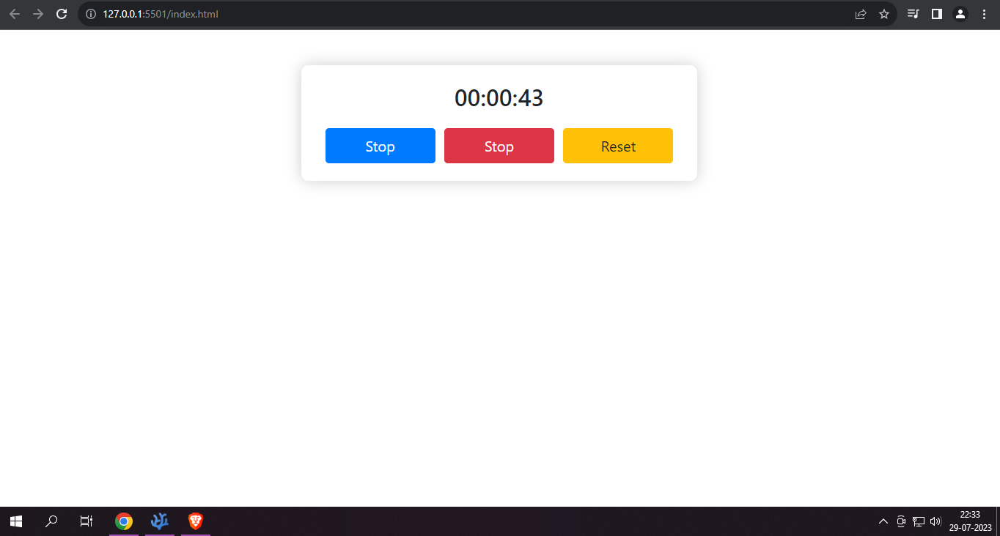

# Stopwatch App

## Description

The Stopwatch App is a simple and user-friendly web application built using Vanilla JavaScript, HTML, and CSS. It allows users to track time accurately with an intuitive and visually appealing stopwatch interface. Whether you need to time your workout, a cooking session, or any activity, this app has got you covered!

## Key Features

1. **Start, Stop, and Reset:** The app offers easy-to-use buttons to start, stop, and reset the stopwatch. Simply click "Start" to begin the timer, "Stop" to pause it, and "Reset" to set it back to zero.

2. **Accurate Timekeeping:** The stopwatch displays time in HH:MM:SS format, ensuring precise tracking of hours, minutes, and seconds.

3. **Sound Effects:** To enhance the user experience, the app includes sound effects for starting, stopping, and resetting the timer.

## How to Use

1. Open the [Stopwatch App]() in your web browser.

2. Click the "Start" button to initiate the stopwatch timer. The displayed time will start counting.

3. If you want to pause the timer at any point, click the "Stop" button.

4. To reset the stopwatch to zero, click the "Reset" button.

5. You can start and stop the stopwatch as many times as you like, and the timer will accurately track the elapsed time.

## Preview

## Live Demo

 [Simple Stopwatch](https://whoismonesh.github.io/SimpleStopWatch/)

## Contributing

If you have any suggestions or improvements for the Stopwatch App, feel free to contribute! You can fork this repository, make your changes, and submit a pull request.

## License

The Stopwatch App is open-source and available under the [MIT License].

## Credits

The Stopwatch App was developed by [Monesh Ram](https://github.com/WhoisMonesh/). If you have any questions or feedback, please don't hesitate to reach out.

Happy timing! 🕒
